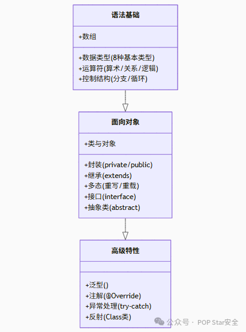

# JAVA-SE基础

‍

## JAVA语法基础

‍

### 概览



### 基本数据类型

Java语言提供了八种基本类型。六种数字类型（四个整数型，两个浮点型），一种字符类型，还有一种布尔型。

区别于**引用数据类型**，直接存储值本身，存储在**栈（Stack）** 中。IO效率极高，并且声明简洁明了。

- **整数：**​`Byte`(8位) ，`short` (16位) ，`int` (32位，最常用)，`long`(64位，后缀L)

- **浮点数：**​`float` (32位，单精度，后缀F)，`double`(64位，双精度，默认)

- **字符：**​`char`(16位Unicode字符)

- **布尔：**​`boolean` (ture/false)

- **默认值：** 成员变量有默认值，如int为0，boolean为false，局部变量必须显式初始化

‍

### 基本类型转换

**隐式转换：** 将数据类型中，取值范围小的数据，给取值范围大的类型赋值，直接赋值。

```java
int a = 10;
double b = a;   // doulbe 占64位，8字节，直接赋值
```

**强制转换：** 把一个表示数据范围大的数值或者变量赋给另一个表示数据范围小的变量

- 格式：目标数据类型 变量名 = (目标数据类型)值/变量;

```java
int a = 1023232323;   			// 1023232323
byte b = (byte) a;				// 67
int c = (int)99.123;			// 99
```

‍

### 引用数据类型

	引用数据类型存储对象的地址（引用），而对象本身存储在**堆（Heap）** 。在堆中创建和销毁对象（需要垃圾回收）以及通过引用来间接访问对象的开销，远大于直接操作**栈（Stack）** 上的值。

- 对象、数组都是引用数据类型。
- 所有引用类型的默认值都是NULL。

**引用数据类型：**

- **类** （Class）
- **接口**（Interface）
- **数组**（Array）
- **枚举**（Enum）
- **注解**（Annotation）
- **特殊NULL类型**
- **字符串**（String）

‍

‍

‍

### 类、方法、变量命名约定

**定义规则：**

- 由数字、字母、下划线和美元符号组成
- 不能以数字开头
- 不能是关键字
- 严格区分大小写

**常见命名约定：**

- 小驼峰命名法，一般用于方法、变量，一个单词则全小写，多个单词则第二个单词开始首字母大写
- 大驼峰命名法，一般用于类，单个单词则首字母大写，多个单词则全部单词首字母大写

‍

‍

### 运算符

**算数运算符**：加（+），减（-），乘（*），除（/），取余（%）

- 两整数相除只能得到整数，想要得到小数需要**浮点数**参与运算
- 取余即取结果的余数

‍

**自增自减运算符**：自增（++），自减（--）

- 单独使用时，++和--在前或者在后时结果都一样
- 当参与其他操作时，在前则先自增（自减）后进行操作，在后则反之。
- 只能操作**变量**，不能操作常量

‍

**赋值运算符：**

- 赋值（=）

- 加后赋值（+=）

- 减后赋值（-=）

- 乘后赋值（*=）

- 除后赋值（/=）

- 取余后赋值（%=）

‍

**关系（比较）运算符：** 返回结果只有true或者false

- 等于（==）
- 不等（!=）
- 大于（>）
- 小于（<）
- 大于等于（>=）
- 小于等于（<=）

‍

**逻辑运算符：**

- ​`&` 与：全真则真，一假则假
- ​`|` 或：全假则假，一真则真
- ​`!` 非：取反，真假假真
- ​`^` 异或：两同为假，不同为真
- 短路逻辑运算符

  - ​`&&` 短路与，作用和`&`相同，但是有短路效果
  - ​`||`短路或，作用和`|`相同，但是有短路效果

‍

> 逻辑短路：
>
> ​`&&`遇到false直接为false，不执行后续代码
>
> ​`||`遇到true则直接为true，不执行后续代码

‍

**三元运算符：**

- 格式： `关系表达式 ? 表达式1 : 表达式2`​
- 执行流程

  - 首先计算关系表达式的值
  - 若为true则取表达式1的值
  - 若为false则取表达式2的值

‍

### 流程控制

**流程控制语句**：通过一些代码，控制程序的执行流

**顺序结构语句**：按照代码的先后顺序执行。

‍

#### **if语句：**

```java
if(关系表达式){
	语句体1;
}else{
	语句体2;
}
```

首先计算关系表达式的值，若为true则执行语句1，若为false则执行语句体2

```java
        Scanner sc = new Scanner(System.in);
        System.out.println("请输入您的年龄");
        int age = sc.nextInt();
        if ( age >= 18){
            System.out.println("您已成年，可以进入");
        }else if (age < 10){
            System.out.println("禁止");
        }else{
            System.out.println("可以进入");
```

还可以使用else if来拓展条件的判断，比较简单不多说了

‍

#### **switch语句：**

```java
            switch(age){
                case 1:
                    System.out.println("你好");
                    break;
                case 2:
                    System.out.println("你好222");
                    break;
                default:
                    System.out.println("默认");
                    break;
            }

```

格式为**switch(将要被匹配的值)** ，取值为byte、short、int、char、jdk7以后可以是String、枚举

case后面跟着要和**表达式比较的值（被匹配的值），break**表示中断，用来结束switch语句

default表示默认选项，所有匹配项都不匹配就执行这个

**case穿透**：当开始case穿透，后续的case就不会具有匹配的效果，内部语句都会执行，直到看到break，或者switch整体执行完成才会结束

‍

‍

‍

#### **for循环语句**：

```java
for(int i=1; i<20; i++){
	System.out.println(i);
}
```

执行**初始化语句（int i=1）** ，执行**判断语句（i&lt;20）** ，如果是true，执行**循环体语句（sout）** ，执行**条件控制语句（i++）** ，回到判断语句继续流程，直到第二步返回false跳出循环

‍

#### while循环语句：

**while循环（不明确循环次数时推荐使用）：**

```java
int i = 1;
while (i<100){
	System.out.println(i);
	i++;
}
```

  

**do...while循环（使用较少）：**

```java
int i = 1;
do{
	System.out.println(i);
	i ++;
}while(i<100);
```

‍

> For循环、while循环、do...while循环的区别：
>
> for循环和while循环先判断条件是否成立，然后决定是否执行循环体（先判断后执行）
>
> do...while循环先执行一次循环体，然后判断条件是否成立，是否继续执行循环体（先执行后判断）
>
> 条件控制语句中所控制的自增变量，因为归属于for循环的语法结构中，在for循环结束后，就不能再次被访问到了
>
> 条件控制语句所控制的自增变量，对于while循环来说不归属其语法结构中，在while循环结束后，该变量还可以继续使用

‍

#### continue与break关键字

- continue：跳过某次循环内容，继续开始下一层循环，只能在循环中使用
- break：跳出整个循环，终止循环体内容的执行，只能在循环和switch中使用
- 标号：可以给语句块加标号赋予它们名称，标号位于语句之前。标号只能被continue和break引用。

‍

‍

#### 

### 数组

**数组（array）** ：是一种容器，用来存储 **同一数据类型** 的多个值。

```java
// 数组的声明
int[] array1;
int array1[];
```

#### 数组初始化

JAVA中的数组必须先初始化，才能使用。

- 动态初始化：初始化时只指定数组长度，由系统分配初始值。
- 格式 `int arr1 = new int[3];`​
- 打印数组变量名，输出的是数组在内存中的地址值。

‍

**静态初始化：** 初始化时，就可以指定数组要存储的元素，系统还会自动计算出该数组的长度

- 格式：`数据类型[] 变量名 = new 数据类型[]{数据1,数据2,数据3,....};`​

‍

#### 数组元素访问

- 数组内存地址的访问：`数组名`​
- 数组内部保存的数据的访问：`数组名[索引]`​
- **索引从0开始**，连续的，逐一增加
- 数组在创建完毕后，没有赋值也能取出，取出的值为0
- 默认值：

  - 整数——0
  - 浮点数——0.0
  - 布尔——false
  - 字符——空字符
  - 引用数据类型——null

‍

#### 数组遍历

使用数组名.length获取数组元素个数，并进行遍历

```java
        int[] arr1 = new int[6];
        for (int i=0;i<arr1.length;i++){
            System.out.println(arr1[i]);
        }
```

‍

‍

### 二维数组

二维数组也是一种容器，不同于一维数组，该容器存储的都是一维数组容器。

**格式：**

- 格式1：`数据类型[][] 变量名;`​
- 格式2：`数据类型 变量名[];`​
- 格式3：`数据类型[] 变量名[];`​

‍

**动态初始化：**​**​`数据类型[][] 变量名 = new 数据类型[m][n];`​** ​

m表示这个二维数组可以存放多少个一维数组 (行)

n表示每一个一维数组，可以存放多少个元素 (列)

将一个提前创建好的一维数组存储到二维数组中：

```java
int[] arr1 = {11, 22, 33};
int[][] arr2 = new int[1][3];
arr2[0] = arr1;
```

#### 

### 内存分配

> Java程序在运行时，需要在内存中分配空间
>
> 为了提高效率，就对空间进行了不同区域的划分
>
> 每一片区域都有特定的处理数据的方式和内存管理方式

- 栈内存：方法运行时，进入的内存，局部变量都存放于这块内存当中
- 堆内存：new出来的内容就会进入堆内存，并且会存在地址值
- 方法区：字节码文件加载时进入的内存

  - JDK 8 之后，方法区由 **Metaspace（元空间）**  实现，不再在堆中。
- 本地方法栈：调用操作系统相关资源
- 寄存器：交给CPU去使用

#### 

### 进制

​**进制**：指进位制：是人们规定的一种进位方式

​**常见进制**：二进制、八进制、十进制、十六进制

- 计算机数据在底层运算的时候，都是以二进制进行的，了解不同的进制，便于我们对数据的运算过程理解的更加深刻

​**十进制**：逢十进一，借一当十

​**二进制**：逢二进一，借一当二（只有0和1）

​**八进制**：逢八进一，借一当八（0，1，2，3，4，5，6，7）

​**十六进制**：0\~9，a\~f（其中a\~f表示10\~15）

> 在Java中，数值默认都是十进制，不需要加任何修饰
>
> 二进制：数值前面以0b开头，b大小写都可
>
> 八进制：数值前面以0开头
>
> 十六进制：数值前面以0x开头，x大小写都可
>
> 注意：书写的时候，虽然加入了进制的标识，但打印在控制台展示的时候都是十进制数据

‍

#### 进制转换

任意进制到十进制公式：系数\*基数的权次幂 相加

- 系数：每一【位】上的数
- 基数：几进制，就是几
- 权：从数值的右侧，以0开始，逐个+1增加

十进制到任意进制的转换公式：除基取余

- 使用源数据，不断地除以基数（几进制就是除几）得到余数，直到商为0，再将余数倒序拼起来即可

快速进制转换法：8421码

- 8421码又称BCD码，是BCD代码中最常用的一种
- BCD：（Binary-Coded Decimal）二进制码十进制数  
  在这种编码方式中，每一位二进制值的1都是代表一个固定数值，把每一位的1代表的十进制数加起来得到的结果就是他所代表的十进制数

‍

#### 原码反码补码

注意：计算机中的数据，都是以二进制补码的形式在运算，而补码则是通过反码和原码推算出来的

原码：（可直观的看出数据大小）就是二进制定点表示法，最高位为符号位，0正1负，其余位表示数值的大小

- 一个字节等于8个比特位，也就是8个二进制位

反码：（将原码转换为补码）正数的反码与其原码相同，负数的反码是对其原码逐位取反，但符号位除外

补码：（数据以该状态进行运算）正数的补码与其原码相同，负数的补码是在其反码的末位加1

> 正数的原反补都是相同的
>
> 负数的【反码】，是根据【原码】取反（0变1，1变0）得到的 （符号位不变）
>
> 负数的【补码】，是根据【反码】的末尾+1得到的

‍

‍

#### 位运算

- 位运算指的是二进制位的运算，先将十进制数转换成二进制后再进行运算
- 在二进制位运算中，1表示true，0表示false  
  ​`&` 位与：遇false则false，遇0则0  
  ​`|` 位或：遇true则true，遇1则1  
  ​`^` 位异或：相同为false，不同为true          (a \= a \^ b \^ b)  
  ​`~` 取反：全部取反，0变1，1变0（也包括符号位）

‍

#### 位移运算符

​`<<` 有符号左移运算，二进制位向左移动，左边符号位丢弃，右边补齐0

- 运算规律：向左移动几位，就是乘以2的几次幂

​`>>` 有符号右移运算：二进制位向右移动，使用符号位进行补位

- 运算规律：向右移动几位，就是除以2的几次幂

​`>>>` 无符号右移运算符，无论符号位是0还是1，都补0

‍

‍

‍

‍

‍

‍

‍

## JAVA面向对象

‍

### 类和对象

**核心：类 = 属性 + 方法。**

类：是对一组具有相同属性和行为的对象的抽象，定义对象的属性（成员变量）和行为（方法）。

对象：是类的实例，代表了实际存在的个体。每个对象可以通过类创建，都拥有类定义的属性和行为。在java中，新建一个对象通过new关键字。

成员变量：定义在类内部的变量，用于描述对象的状态（属性）。也称为实例变量。

成员方法：定义在类内部的函数，用于定义对象的行为。

**构造方法：**

- 在**实例化对象时会调用**，构造方法名必须**与类名完全相同。**
- 构造方法可以调用成员方法，成员方法不可以调用构造方法。
- 可以进行重载。
- 可以使用`this(param)`调用同类中的其他构造方法（必须放在第一行）
- 如果构造方法规定了传入变量，实例化时必须传入同类型变量。

‍

这里定义一个银行账户的类

```java
public class BankAccount {
    // 定义 私有属性
    private double balance;

    // 公共方法操作私有属性
    public void deposit(double amount){
        if (amount > 0){
            balance += amount;
            System.out.println("成功存入" + amount + " 元，当前余额为： " + balance);
        }else{
            System.out.println("存入金额必须大于0，请重新输入");
        }
    }

    public void withdraw(double amount){
        if (amount > 0 && amount <= balance){
            balance -= amount;
            System.out.println("成功取出 " + amount + " 元，当前余额为：" + balance);
        }else{
            System.out.println("余额不足，无法取出" + amount + " 元。");
        }
    }

    public double getBalance(){
        return balance;
    }
}
```

可以通过实例化对象来使用这个类

```java
public class BankTest {
    public static void main(String[] args) {
        BankAccount bankAccount = new BankAccount();
        bankAccount.deposit(1000);
        bankAccount.withdraw(500);
        System.out.println("当前账户余额为" + bankAccount.getBalance() + " 元。");
    }
}
```

在这个例子中，`BankAccount`类定义了银行账户的属性（`balance`）和方法（`deposit()`、`withdraw()`、`getBalance()`）。

通过将balance属性设置为私有，我们实现了封装，外部代码只能通过公共方法来操作这个属性，保证了数据的安全性。

‍

### 核心特性

**JAVA面向对象编程（OOP）** 的核心特性包括**封装、继承、多态和抽象**，这些特性共同实现了代码的模块化、复用性和灵活性。

‍

#### 封装

将**数据（属性）** 和操作数据的**行为（方法）** 绑定在一个**类**中，并**隐藏内部实现细节**，仅通过**公开的接口**与外界交互。

通过访问修饰符（例如`private`）限制对属性的直接访问，提高安全性。

在JAVA中，主要有以下四种访问修饰符。

|修饰符|同类|同包|子类|任意|
| :---------: | :----: | :----: | :----: | :----: |
|private|✅|❌|❌|❌|
|default|✅|✅|❌|❌|
|protected|✅|✅|✅|❌|
|public|✅|✅|✅|✅|

- ​**private**：使用 `private` 修饰的成员（属性或方法）只能在同一个类中访问。这是最严格的访问控制，它可以很好地隐藏类的内部实现细节。
- ​**default**：如果不使用任何访问修饰符，那么成员的访问权限就是默认的。默认访问权限允许同一个包中的其他类访问该成员。
- ​**protected**：`protected` 修饰的成员可以在同一个类、同一个包中的其他类以及不同包中的子类中访问。
- ​**public**：`public` 修饰的成员可以被任何类访问。

```java
public class AccessModifierExample {
    private int privateField = 1;
    int defaultField = 2;
    protected int protectedField = 3;
    public int publicField = 4;

    private void privateMethod() {
        System.out.println("This is a private method");
    }
    void defaultMethod() {
        System.out.println("This is a default method");
    }
    protected void protectedMethod() {
        System.out.println("This is a protected method");
    }
    public void publicMethod() {
        System.out.println("This is a public method");
    }
}


public class AccessModifierTest {
    public static void main(String[] args) {
        AccessModifierExample example = new AccessModifierExample();
        // 不可访问 privateMethod，因为在其他类中无权访问
        example.privateMethod();
        example.defaultMethod();
        example.protectedMethod();
        example.publicMethod();
    }
}
```

会发现无法通过编译，private的方法只能通过其他公共方法访问。

**封装**可以提升程序的安全性，防止数据被意外修改，确保数据合法性。

**封装**可以降低对象之间的耦合，便于后续维护。

‍

#### 继承

子类继承父类的属性和方法，实现代码复用，并可通过扩展或重写父类功能建立类之间的层次关系。

- Java仅支持单继承（一个类只能继承一个父类）
- 通过`extends`关键字实现
- 子类可重写（Override）父类方法

  - - 子类方法访问权限 **不能比父类更严格**（比如父类是 `public`，子类不能改成 `protected`）。
    - 子类重写方法时，**返回值类型** 可以是父类返回值的 ​**子类（协变返回类型）** 。

```java
public class Animal {
    public void eating(){
        System.out.println("Animal eating");
    }
}

class Dog extends Animal{
    @Override
    public void eating(){
        System.out.println("Dog eating");
    }
    
    public static void main(String[] args) {
        Animal dog1 = new Dog();
        dog1.eating();
    }
}
```

这样实例化生成的Dog对象，由于我们在Dog里面重写了Animal的方法，所以调用的还是Dog的eating。

​`new Dog()` 这部分 **是创建了一个 Dog 对象，** 由于 **Dog 是 Animal 的子类**，Java 允许 **父类引用指向子类对象**，这就是所谓的 **向上转型（Upcasting）** 。

‍

> Java 调用方法遵循 **动态绑定（Dynamic Dispatch）**  原则：
>
> - ​**编译阶段**：只看变量的类型（这里 `dog1` 是 `Animal`），编译器确认 `Animal` 里确实有 `eating()` 方法，所以编译不会报错。
> - ​**运行阶段**：JVM 会根据对象的实际类型（这里是 `Dog`）来决定执行哪个方法。  
>   所以最终会输出：

‍

#### 多态

同一操作作用于不同对象时，表现出不同的行为。分为编译时多态（重载）和运行时多态（重写）。多态能够帮助提高代码灵活性和可扩展性。

- 运行时多态（方法重写）

```java
public class Animal{
    public void eat(){
        System.out.println("Aminal is eating.");
    }
}

class Dog extends Animal{
    @Override
    public void eat(){
        System.out.println("Dog is eating.");
    }
}

class Cat extends Animal{
    @Override
    public void eat(){
        System.out.println("A cat is eating.");
    }

    public static void main(String[] args) {
        Animal dog1 = new Dog();
        Animal cat1 = new Cat();

        dog1.eat();
        cat1.eat();  // 根据对象类型决定执行的方法
    }
}
```

也就是说子类可以对父类的方法进行重写，在运行时编译器才会根据对象的实际类型来决定执行哪个方法。

​ **​`@Override`​** 注解 是一个好习惯，它会使编译器检查是否成功继承了父类方法。

‍

- 编译时多态（方法重载）

```java
public class Calcuator {
    int add(int a,int b){
        return a+b;
    }

    double add(double a,double b){
        return a+b;
    }

    public static void main(String[] args) {
        Calcuator c = new Calcuator();
        c.add(1, 3);
        c.add(1.23, 1.14);  // 根据传入参数的类型决定
    }
}
```

一个方法名可以有多个不同的实现，具体运行哪一个要取决于传入的参数和参数类型。

‍

#### 抽象

- 通过抽象类或接口定义规范，隐藏复杂实现细节，仅暴露必要功能。
- Java中使用抽象能够定义通用模板，强制子类实现约定功能，分离接口与实现。

**抽象类：**

- Java中定义一个抽象类使用`abstract`关键字。抽象类中的抽象方法需要加`abstract`关键字，该方法无具体实现。
- 即可有**抽象方法**，也可以存在**普通方法**。
- **不能直接实例化**，必须由子类继承并实现抽象方法。

例如，下面定义了形状的抽象类Shape，具体形状类圆`Circle`继承了`Shape`类的属性和方法，并对方法具体实现。

```java
public abstract class Shape {
    abstract double area();
}


class Cricle extends Shape{
    double radius;
    Cricle(double r){
        radius=r;
    }
    @Override
    public double area() {
        return Math.PI*radius*radius;
    }

    public static void main(String[] args) {
        Shape shape=new Cricle(10);
        System.out.println(shape.area());
    }
}
```

这里写了一个构造方法，表示创建`Circle`时必须传入radius，**构造方法与类名相同**。

定义抽象类和抽象方法是Java面向对象编程中非常重要的设计工具，它们主要用于**制定规范、强制约束和实现多态**。核心思想是： **“只定义能做什么（what），而不关心具体怎么做（how）”** 。

‍

**接口：**

Java中接口使用`interface`关键字定义，Java8以后interface类中支持默认方法（方法前加default关键字）。

接口是一种规范，也是完全抽象的类，只要实现了该接口的类，就必须提供它定义的方法，不同的类可以用自己的方式实现这个方法。

- 只能包含抽象方法（Java8以后可以有默认方法）
- 只能包含public static final常量
- 支持多重继承（**一个类可以实现多个接口**）

接口 = “约定” + “能力标签”。

```java
interface Swimmable {
    void swim();
}

interface Flyable {
    void fly();
}

// 鸭子：既能游泳，也能飞
class Duck implements Swimmable, Flyable {
    public void swim() {
        System.out.println("Duck is swimming.");
    }
    public void fly() {
        System.out.println("Duck is flying.");
    }
}

// 鱼：只能游泳
class Fish implements Swimmable {
    public void swim() {
        System.out.println("Fish is swimming.");
    }
}

// 鸟：只能飞
class Bird implements Flyable {
    public void fly() {
        System.out.println("Bird is flying.");
    }
}

public class Zoo {
    public static void main(String[] args) {
        // 统一管理所有会游泳的动物
        Swimmable[] pool = { new Duck(), new Fish() };
        for (Swimmable s : pool) {
            s.swim();
        }

        // 统一管理所有会飞的动物
        Flyable[] sky = { new Duck(), new Bird() };
        for (Flyable f : sky) {
            f.fly();
        }
    }
}

```

这里的Duck类就是实现了`Swimmable`和`Flyable`两个接口。

接口的作用是 **定义能力，方便统一管理和多态调用**。

‍

‍

**抽象类与接口**-**总结：**

- **抽象类**更适合表示 ​ **“is-a” 关系**（比如 Cat 是 Animal）。
- **接口**更适合表示  **“can-do” 能力**（比如 Bird 可以 Fly）。

‍

‍

### 面向对象设计原则

面向对象设计原则是一组指导我们设计高质量、可维护、可扩展的面向对象系统的原则。其中，SOLID 原则是最著名的一组原则，它包括**单一职责原则（SRP）、开闭原则（OCP）、里氏替换原则（LSP）、接口隔离原则（ISP）和依赖倒置原则（DIP）。**

‍

#### 1. **S**RP：一个类的修改只能有一个原因

单一职责原则要求一个类只负责一项职责。如果一个类承担了过多的职责，那么当其中一个职责发生变化时，可能会影响到其他职责，从而增加代码的耦合度和维护难度。

#### 2. **O**CP：对扩展开放，对修改关闭

开闭原则要求软件实体（类、模块、函数等）应该对扩展开放，对修改关闭。也就是说，当需求发生变化时，我们应该通过扩展现有代码来实现，而不是修改现有的代码。

#### 3. **L**SP：子类必须能替代父类

里氏替换原则要求子类必须能够替换其父类，并且不会影响程序的正确性。也就是说，子类应该遵守父类的行为约定，不能改变父类的行为。

#### 4. **I**SP：接口隔离

接口隔离原则要求客户端不应该依赖它不需要的接口。也就是说，一个类对另一个类的依赖应该建立在最小的接口上。

#### 5. **D**IP：依赖抽象而非实现

依赖倒置原则要求高层模块不应该依赖低层模块，二者都应该依赖抽象。抽象不应该依赖细节，细节应该依赖抽象。

#### 6. 迪米特原则（Law of Demeter, LoD）

 ‌一个类应该只和它的成员变量、方法的输入、返回参数中的类作交流，而不应该引入其他的类。

#### 7. 合成复用原则（Composition over Inheritance）

尽量使用组合，而不是继承，避免继承层次过深。
