# JavaWeb概述

JAVA WEB的开发，本质上是Http接口的开发。因为无论是开发Web页面，还是Restful API，都是在服务端开发基于Http协议的接口。

而对于Http服务端的开发，JavaEE（Java Platform Enterprise Edition，Java企业平台）平台本身提供了**Servlet标准**，它被作为基础框架来支撑和规范Java Web应用的开发。

基于该标准，发展出了Tomcat，JSP（Java Server Pages），Spring MVC，Spring Boot等Web服务器和开发框架，用来简化Web服务端的开发。

**技术架构演进关系**

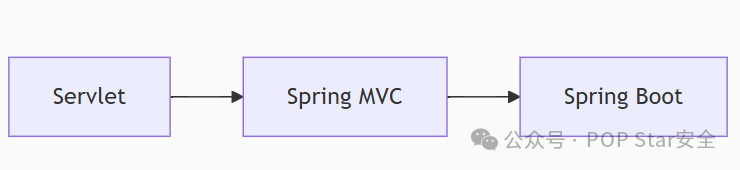

‍

## JavaWeb框架-Servlet

### 概论

​`Servlet`是Java EE（现Jakarta EE）规范中定义的接口。它是一个运行在Web服务器（如Tomcat、Jetty）或应用服务器（如WildFly、GlassFish）中的Java程序，用于处理客户端的HTTP请求并生成HTTP响应。

Servlet是Java Web技术的底层基础，它直接与HTTP协议交互。

**它可以**

- 接收请求（HttpServletRequest）
- 处理业务逻辑（或调用业务逻辑层）
- 生成相应（HttpServletResponse - HTML、JSON、XML等）
- 管理会话（HttpSession）
- 处理Cookie

**开发方式**

- 需要继承HttpServlet并重写`doGet()` 、`doPost()`等方法
- 需要在web.xml中配置Servlet的映射解析路径
- 需要手动管理很多细节（如请求参数解析、视图渲染、异常处理等）

‍

### 简单的Servlet项目

**Demo演示：**

我们用idea直接新建好Servlet项目

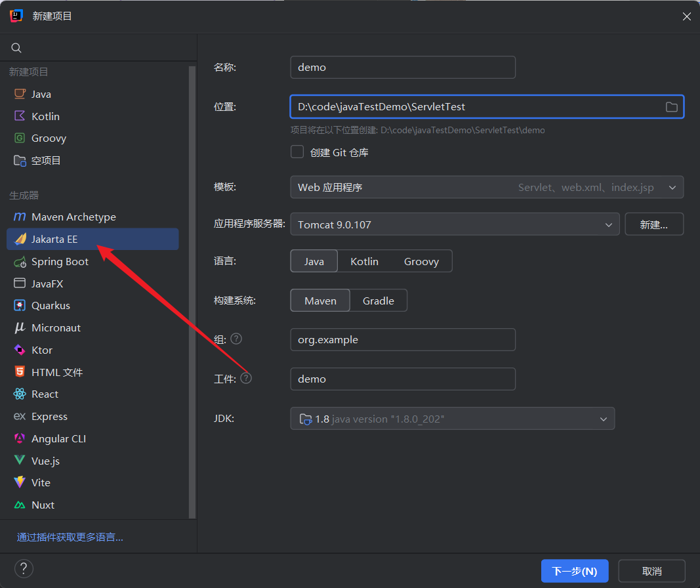

idea会新建好web.xml和jsp文件，下面是一个简单的类实例

```java
package org.example.demo;

import java.io.*;
import javax.servlet.http.*;
import javax.servlet.annotation.*;

public class HelloServlet extends HttpServlet {
    @Override
    protected void doGet(HttpServletRequest req, HttpServletResponse resp)
            throws IOException {
        resp.setContentType("text/html;charset=UTF-8");

        PrintWriter out = resp.getWriter();
        out.println("<html><body>");
        out.println("<h1>Hello, Servlet!</h1>");
        out.println("</body></html>");
    }
}
```

需要配置好tomcat服务器，并且配置web.xml文件，指定类和对应的路由

```xml
<?xml version="1.0" encoding="UTF-8"?>
<web-app xmlns="http://xmlns.jcp.org/xml/ns/javaee"
         xmlns:xsi="http://www.w3.org/2001/XMLSchema-instance"
         xsi:schemaLocation="http://xmlns.jcp.org/xml/ns/javaee http://xmlns.jcp.org/xml/ns/javaee/web-app_4_0.xsd"
         version="4.0">


    <servlet>
        <servlet-name>HelloServlet</servlet-name>
        <servlet-class>org.example.demo.HelloServlet</servlet-class>
    </servlet>
    <servlet-mapping>
        <servlet-name>HelloServlet</servlet-name>
        <url-pattern>/hello</url-pattern>
    </servlet-mapping>
</web-app>
```

我这里设置了/hello路由，指定`HelloServlet`类，访问http://127.0.0.1:8080/hello页面，这样就可以返回`HelloServlet`类中`doGet()`方法，当然也可以使用`doPost()`来接收POST请求

‍

### Servlet生命周期

那么在上述过程中Servlet底层是如何处理请求的呢

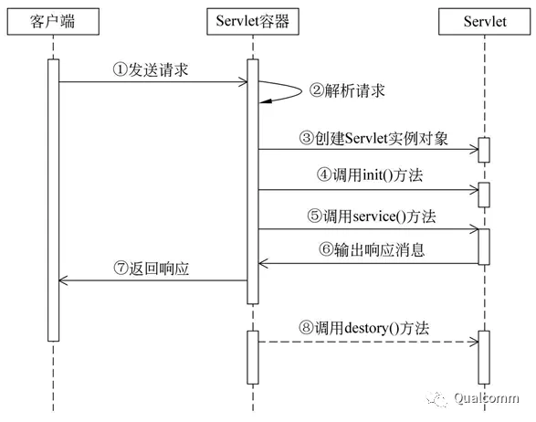

上图可以表示Servlet生命周期的整个过程，大致分为三个阶段

- 初始化
- 执行
- 销毁

‍

**初始化阶段(init)**

这里新建一个类，用注释的方式定义路由，更加清晰直观一点（ **@WebServlet注解是Servlet3.0规范中引入的特性，冲突以web.xml为准**）

```java
@WebServlet(name = "TestServlet", value = "/helloyou")
public class TestServlet extends HttpServlet {
    @Override
    public void init() {
        System.out.println("TestServlet init");
    }

    @Override
    protected void doGet(HttpServletRequest request, HttpServletResponse response) throws ServletException, IOException{
        PrintWriter out = response.getWriter();
        out.println("hello, world");
    }

    @Override
    protected void doPost(HttpServletRequest request, HttpServletResponse response) throws ServletException, IOException{
    }
}
```

使用`@WebServlet(name="TestServlet", value="/hello")`这种方式表示/hello路由，省去了配置web.xml的复杂操作

并且当我们访问该路径时，`init()`是最先触发的方法

‍

**执行阶段(service)**

service方法是执行实际的代码的方法，这个方法会去处理来自客户端的请求，会根据`request.getMethod()`来判断请求类型，并自动调用相应的`doGet()`或者`doPost()`等方法，它触发较`init()`晚但是较`doGet()`和`doPost()`要早

‍

```java
@WebServlet(name = "TestServlet", value = "/helloyou")
public class TestServlet extends HttpServlet {
    @Override
    public void init() {
        System.out.println("TestServlet init");
    }

    protected void service(HttpServletRequest req, HttpServletResponse resp) throws ServletException, IOException {
        PrintWriter out = resp.getWriter();
        out.println("xxxxxxxxxxxxx");
    }

    @Override
    protected void doGet(HttpServletRequest request, HttpServletResponse response) throws ServletException, IOException{
        PrintWriter out = response.getWriter();
        out.println("hello, world");
    }
}

```

这样访问页面斌不会触发`doGet()`方法，而是触发了service方法

如果没有service方法的话，会根据客户端的**请求方式**来决定触发`doGet()`还是`doPost()`​

‍

**销毁阶段(destroy)**

销毁方法只会在Servlet生命周期结束的时候进行一次调用，一般来说这个方法常用来关闭数据库的连接或者关闭一些流操作。

```java
    public void destroy(){
        System.out.println("TestServlet destroy");
    }
```

这里会发现关闭tomcat时即可触发该方法

‍

### Servlet参数传递方式

‍

#### **getParameter()方法**

可以用`req.getParameter("id");`来接收id参数，使用方法定义时的`HttpServletRequest req`，它抽象了HTTP请求的内容，这是Servlet中最常用的传参方式

```java
public class LoginServlet extends HttpServlet {
    @Override
    protected void doGet(HttpServletRequest req, HttpServletResponse resp)
            throws ServletException, IOException {
        resp.setContentType("text/html;charset=UTF-8");
        PrintWriter out = resp.getWriter();
        String id = req.getParameter("id");
        out.println(id);
    }
}
```

并可以使用`PrintWriter`将id值打印在返回包里面

‍

#### **getParameterValues()方法**

同样是在`doGet()`、`doPost()`或者`service`中都适用，这个方法与`getParameter()`不同的地方是它可以获取多个值，并返回一个数组

对于多值参数，始终应该使用`getParameterValues()`，如果不确定到底有几个值，也应该使用它来接收，并进行空值检查

```java
    protected void doGet(HttpServletRequest request, HttpServletResponse response) throws ServletException, IOException {
        String[] hobbies = request.getParameterValues("hobby");

        if (hobbies != null){
            for (String hobby : hobbies) {
                System.out.println(hobby);}
        }
    }
```

这样我们输入 `http://127.0.0.1/helloyou?hobby=sport&hobby=swim` 就可以传递多个值

‍

#### getParameterNames()、getParameterMap 方法

它们可以用来获取多个参数和对应的值，同样是在`doGet()`、`doPost()`或者`service`中都适用

```java
    @Override
    protected void doGet(HttpServletRequest request, HttpServletResponse response) throws ServletException, IOException{
        Enumeration<String> names = request.getParameterNames();
        while(names.hasMoreElements()){
            String name = names.nextElement();
            String value = request.getParameter(name);
            System.out.println(name + ":" + value);
        }
    }
```

‍

#### getInputStream()、getReader() 方法

接收流的传参其实也很好理解，就是类似于php中的 `file_get_contents('php://input')`这种方式，接收HTTP数据包流

```java
    protected void doPost(HttpServletRequest request, HttpServletResponse response) throws ServletException, IOException {
        ServletInputStream inputStream = request.getInputStream();
        byte[] arr = new byte[1024];
        int len;
        while ((len = inputStream.read(arr)) != -1){
            System.out.println(new String(arr,0,len));
        }
        inputStream.close();
    }
```

同样也是可以用在`doGet()`、`doPost()`或者`service`中

‍

注意这里如果先调用了`getParameter()`, `getParameterValues()` 等方法，可能会无法获取到完整的数据流，所以如果需要接收数据流直接使用`getInputStream()`以及`getReader()`，而不要先调用任何其他方法

‍

### Servlet总结

> 	Servlet 容器（例如tomcat）本质上就是一个TCP Server，它首先会去监听服务端的某个端口，例如8080，并在请求来临时获取Socket。再从Socket中获取Http请求参数（包括Head、URL、Body中的数据），把请求参数传递给真正处理业务逻辑的Handler，Handler处理完数据后，再把返回写入到Socket，完成整个Http的服务端响应过程。
>
> 	以上Http请求的监听、Handler的选择、请求参数的处理、请求结果的返回，这些所有Http接口的处理逻辑都是一致，可以封装为公共的部分，但业务处理Handler，由业务决定，跟着业务的逻辑走。这就是Servlet标准所定义的两个方面，即Servlet容器和Servlet API。

‍

Servlet容器，即以上所说的公共部分，它对底层的TCP业务进行了封装，同时，它对具体的业务处理Handler进行了抽象，并作为Handler对象的容器，来承载具体Http业务接口的处理逻辑。目前最流行的Servlet容器是Tomcat，此外还有Jetty、GlassFish等。

	Servlet API，即以上所说的业务处理Handler，它实现具体的业务逻辑，但要借助于Servlet容器，来获取请求，并将结果返回。Servlet标准对Servlet Api作了抽象，即Servlet接口，如下图所示，Servlet容器将请求和返回封装成ServletRequest对象和ServletResponse对象，并传递给具体的Servlet API，使之从ServletRequest对象中获取请求参数，作业务处理，并将处理结果写入ServletResponse对象。    

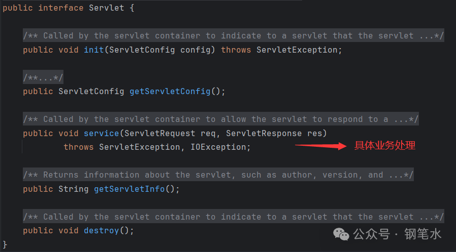

具体针对于Http协议的API，Servlet框架又定义了HttpServlet抽象类，它部分实现Servlet接口，并定义了HttpServletRequest和HttpServletResponse（分别继承自ServletRequest和ServletResponse），来封装Http的请求和返回。在进行Servlet API开发时，可以继承HttpServlet，并重写相应接口方法，如下图所示：

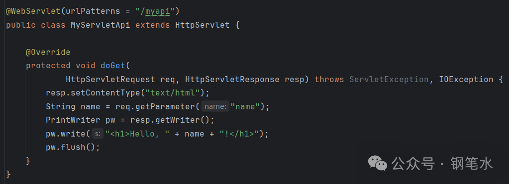

再说JSP，它的全称是Java Server Pages，它允许开发人员在后缀名为.jsp的文件上写Html代码，Servlet容器可以把它编译成Servlet API，以提供输出Html文本的Http接口。因此，JSP可认为是一种特殊的Servlet API，它为开发Html页面提供了方便。

Servlet API在部署时，需要先准备好容器环境，如Tomcat，然后再将编译和打包后的文件，即**war包**，**它会携带所有依赖的jar包以及编译好的class文件**，将它拷贝到Servlet对应的目录下，如Tomcat的webapps目录下，重启容器后即完成了服务的部署。

**Spring MVC**本质上是对Servlet API的再一次封装，**DispatcherServlet**还是一个**Servlet**，只不过Spring用**IOC容器**来管理Controller，帮开发者屏蔽了底层细节。

‍

#### **Servlet与JSP**

- 早期，很多开发者直接写 **JSP 页面**（里面夹杂 HTML + Java 代码 `<% %>`），再通过 `web.xml` 映射，完成简单的逻辑和页面展示。
- 后来，开发者会把业务逻辑写在 **Servlet** 类里，负责处理请求、调用业务代码、准备数据；  
  然后通过 `RequestDispatcher.forward()` 转发到 JSP 页面，JSP 只负责展示页面（MVC 模式）。
- JSP是早期视图层（View）的一种实现，也**可以替换**成其他模板引擎（Thymeleaf、FreeMarker等），在现代Spring Boot中，**JSP已经基本被弃用。**

‍

#### **Servlet与历史漏洞**

- **JSP 马**：其危险性源于 JSP 技术本身**将视图与业务逻辑耦合**的设计。黑客上传的 `.jsp` 文件会被容器直接编译执行。现代 MVC 架构**分离了逻辑与视图**，并且 Spring Boot 等框架默认**不再支持 JSP**，使得此类漏洞大大减少。
- ​**Tomcat Manager 弱口令上传 War 包**：这本质上是**运维安全**问题。Tomcat 提供的管理功能（`/manager/html`）如果暴露在公网且使用弱口令，攻击者可以直接部署恶意的 War 包来获取 Shell。现代部署实践中，管理后台通常会被隐藏或置于内网，并强制使用强密码，从而 mitigating（缓解）这种风险。

‍

## Spring-框架

​`Spring Framework`是其他所有`Spring`项目的基础，例如`Spring Web MVC`框架，`Spring WebFlux`响应式Web框架，用于自动配置和创建微服务的`Spring Boot`扩展。

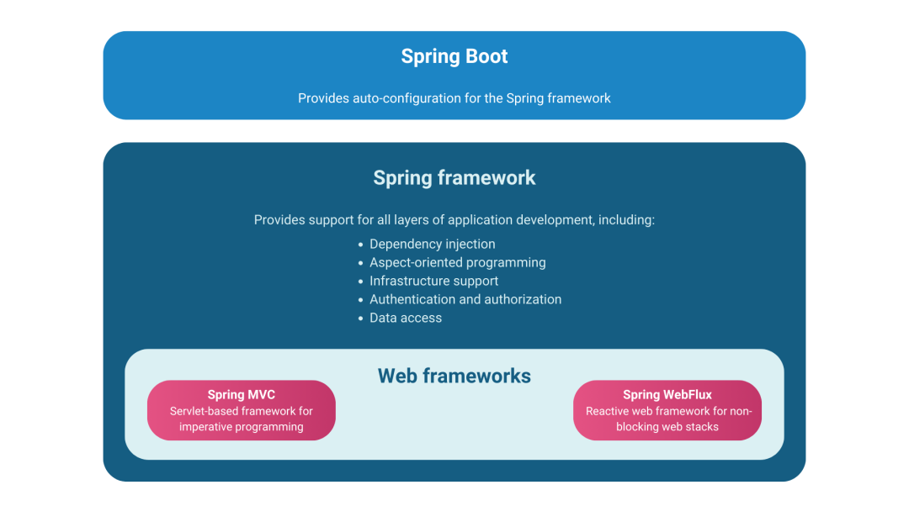

Spring是一个轻量级的**Java开发框架**，用于帮助企业环境中采用和应用Java。Spring提供了对不同应用架构的基本支持。该框架涵盖了消息传递、事务数据和持久化以及Web。Spring还包括两个Web框架：**Spring MVC和Spring WebFlux。**

为Java应用程序开发提供了全面的基础架构支持。包含很多**开箱即用**的模块，如：**SpringJDBC**、**SpringSecurity**、**SpringAOP**、**SpringORM**，提高了应用开发的效率。

‍

它既轻量级又非常灵活，提供直观的API，并提供向后兼容性，以便更容易进行维护。该框架支持应用程序开发的所有层次，通过依赖注入实现松耦合，并支持轻松进行测试。

- 支持声明式编程，例如在不描述控制流的情况下计算逻辑。
- 通过XML和注释配置提供配置Spring的灵活性。
- 通过Spring IOC或面向方面的编程（AOP）提供中间商服务，例如在开发分布式应用程序时。

‍

## Spring-Web框架

Sping提供了两个Web框架，Spring Web MVC和Spring WebFlux。

Spring Web MVC是最初包含在Spring框架中的Web框架，转为Servlet API和Servlet容器设计。

后来添加的Spring WebFlux是一个响应式堆栈的工作框架。

**Web MVC和WebFlux可以共存**，并作为可选模块工作，因此可以根据应用程序的要求使用其中一个或两个。

‍

### Spring Web MVC

纯Servlet的开发，还是比较偏底层，开发时需要通过HttpServletRequest和HttpServletResponse来获取请求和处理返回，且如果是开发返回html的接口，则后端业务逻辑代码和前端Html代码会混合在一起，而如果是开发Restful API，则需要自行将业务逻辑的返回转成Json再返回。随着MVC（M：Model，V：View，C：Controller）开发思想的兴起，Spring MVC框架应运而生。

‍

MVC开发思想的核心是，后端业务逻辑代码与前端处理逻辑代码的分离，并通过数据模型（对于Java来说就是一个Java Bean）来对接彼此。拿返回Html的接口来说，后端在Controller层专心处理数据业务逻辑，并返回一个Model给前端视图层。视图层用于开发前端Html代码，并由视图引擎将Model整合进前端Html中。最终完整的Html文本返回给前端浏览器。

对于我们安全来说需要在意的是**Controller层**。

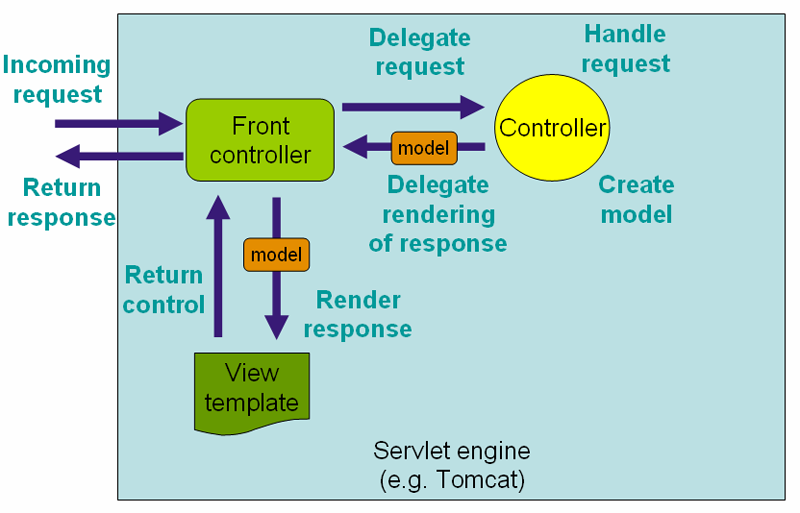

Spring MVC在Spring框架之上，实现了MVC的开发思想，并在底层延用了Servlet的技术路线。与普通Servlet Web程序不同的是，整个Spring MVC程序只用一个Servlet API来处理所有Http请求，即`DispatcherServlet`。`DispatcherServlet`作为所有Http请求流量的入口，负责将请求转发至实际处理业务的Controller，转发过程中，将HttpServletRequest中的参数转化成更易读的形式（如一个自定义的Java Bean），Controller中处理后端业务逻辑，处理完成的结果封装成Model，返回给视图引擎（html接口），或者序列化成Json（rest接口），并在最终又回到`DispatcherServlet`，将处理后的结果写入Http的响应中。因此，Spring MVC本质上还是一个基于Servlet标准的Web程序。

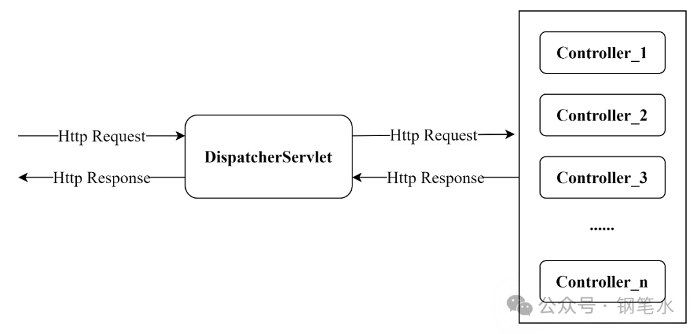

Spring MVC的底层核心，还包括Spring框架的IOC容器，即`ApplicationContext`。它由`DispatcherServlet`在初始化的时候创建并持有（见下图`DispatcherServlet`的初始化配置文件），而所有Controller对象都是在IOC容器中的，因此`DispatcherServlet`在收到请求后，可以根据路径，找到对应的Controller进行处理。

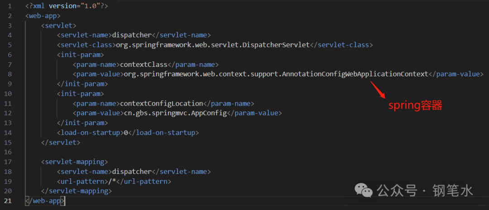

‍

‍

### Spring WebFlux

**Spring WebFlux**是一个反应式且完全非阻塞的框架，能够处理并发并实现高效扩展。在更复杂的应用程序中，反应性对于互操作性至关重要，这些应用程序需要高级别和功能丰富的API来组合异步逻辑。

**WebFlux使用Reactor库**，该库专注于服务器端**Java**，因此**Reactor**是一个核心依赖项。但是**WebFlux**实际上也可以通过**Reactive Streams**与其他反应式库一起使用。

使用WebFlux的好处在于：

- 支持多种服务器（包括Netty、Tomcat、Jetty、Undertow和Servlet容器）
- 提供两种编程模型的选择（注解控制器和功能性Web端点）
- 并允许选择要使用的反应式库（Reactor、RxJava或其他库）。

‍

**Spring WebFlux**是为需要**高并发、响应式场景（如微服务、长连接、消息推送）提供的另一种选择**。

大多数传统 Web 项目依旧用 Spring MVC。

‍

### Spring Boot

​`Spring Boot`在Spring框架之上，提供了一组开箱即用的套件，并极大简化了Spring应用程序的开发。基于Spring Boot的Web开发，提供了Spring MVC的开发套件，即POM文件中引入的`spring-boot-starter-web`。与纯Spring MVC开发相比，它简化了开发中的配置和开发完成后的部署。

在简化开发配置方面，与纯Spring MVC开发相比，它不需要单独针对`DispatcherServlet`的初始化进行XML配置，框架自身提供了自动配置的能力。

在简化程序部署方面，Spring Boot框架内嵌了`Servlet容器`（默认为`Tomcat`）,这样所开发的Web应用程序，可以通过命令行直接运行，不再需要提供额外的Servlet容器环境。

‍

- Spring Boot对Spring提供了一种见解，提供了“starter”依赖项和对Spring和第三方库的自动配置，以便快速启动。这使得Spring Boot成为从零开始引导Spring应用程序的强大工具。

- Spring Boot基本上是Spring应用程序的项目初始化器，可以帮助开发人员开发用于网站和整个基于移动设备的应用程序的微服务。在检查类路径和配置的Bean后，Spring Boot会尝试自动确定和添加丢失的元素。Spring Boot自动提供默认代码和基于注解的配置，加速应用程序的开发。Spring Boot还提供了一系列可用于生产的功能，包括各种指标、健康检查和外部化配置。

- Spring Boot可以与流行的内嵌式Servlet容器（包括Tomcat、Jetty和Undertow）一起使用，但Spring Boot应用程序也可以部署到与Servlet 5.0+兼容的任何容器中。**例如打包为war部署到Tomcat，亦或者打包成jar直接部署。**

- Spring Boot的主要优势在于它提供了一种简单而非常快速的构建和部署应用程序的方式。使用它有助于减少代码长度，并轻松获得Spring框架的优势。

- Spring Boot提供的自动配置节省了编写代码的时间和精力成本，减少了开发时间并简化了配置。Spring Boot使你能够以符合DevOps和云友好的方式构建应用程序。它易于启动、管理和定制，并且不需要XML配置。

‍

‍

#### 简单的Spring boot项目

这里来写一个小demo看看，首先创建项目，选择Spring Web依赖

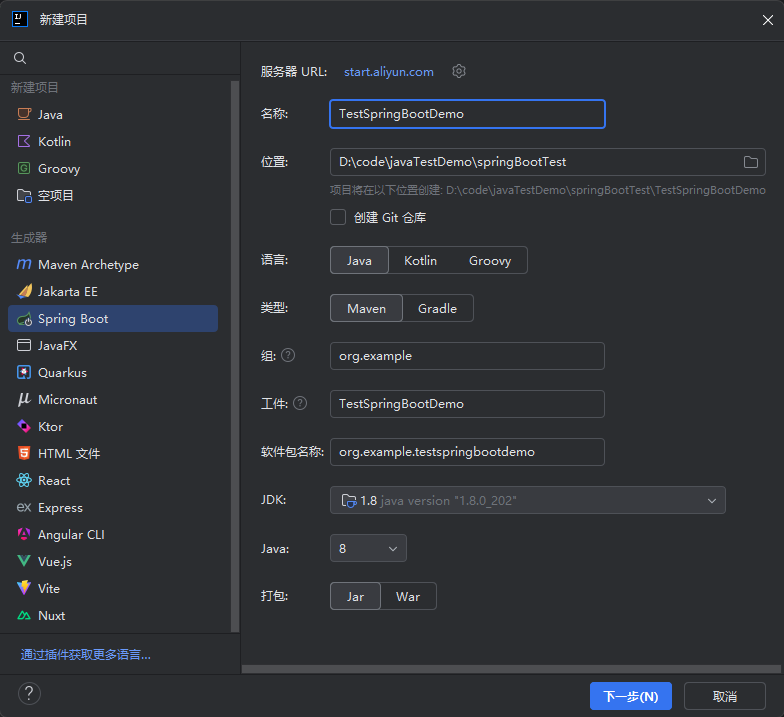

写一个Controller控制器

```java
package org.example.testspringbootdemo.demos.web;

import org.springframework.web.bind.annotation.GetMapping;
import org.springframework.web.bind.annotation.RequestParam;
import org.springframework.web.bind.annotation.RestController;

@RestController
public class HelloController {

    @GetMapping("/hello")
    public String hello(@RequestParam(defaultValue = "World") String name){
        return "Hello "+name+"!";
    }
}
```

这样就可以了，启动`Application`服务，直接访问`127.0.0.1:8080/hello`，这样页面就回返回我们控制器中return的内容

‍

#### Spring Boot 路由定义

这就很简单了，只需要通过注解来规定

```java
package org.example.testspringbootdemo.demos.web;

import org.springframework.web.bind.annotation.*;

@RestController
public class HelloController {

    @PostMapping("/hello")
    public String hello(@RequestParam(defaultValue = "World") String name){
        return "Hello "+name+"!";
    }

    @GetMapping("/hello")
    public String birthday(@RequestParam(defaultValue = "World") String name){
        return "Happy! "+name+"!";
    }

    @RequestMapping("/")
    public String index(){
        return "hello world!";
    }
}
```

​`@RequestMapping("/index")`即表示GET方法或者POST方法均可，也可以使用`@GetMapping("/hello")`只接收GET方法

‍

#### Spring Boot 参数传递

##### 隐式声明

看起来最简单的一种传参方式，直接在方法名规定参数即可

```java
@RestController
public class HelloController {
    @GetMapping("/hello")
    public String birthday(String name,int age){
        return "Happy! "+name+"!" + age;
    }
}
```

这种方式被称为隐式绑定，是因为Spring后台会进行参数解析，如果是简单类型的参数（String、int、integer、long、boolean），spring会默认尝试从**请求参数**中查找同名的参数并绑定

这个过程是由Spring的`HandlerMethodArgumentResolver`机制完成的，具体是`RequestParamMethodArgumentResolver`在处理简单类型时，即使没有注解也会尝试解析

这种方式优点是代码整洁干净，基本类型的参数会获得默认值，而不会抛出错误；对于不熟悉Spring的开发者可能不知道参数是从哪里来的

‍

##### 显式声明

与隐式声明很接近，区别是规定好了哪些参数必须从请求获取，优点在于代码可读性高，可以设置默认参数，缺点就是灵活性差一点，缺少参数就会抛出异常

在要获取的参数前加上`@RequestParam`即可

```java
@RestController
public class HelloController {
    @GetMapping("/hello")
    public String birthday(@RequestParam String name,@RequestParam int age){
        return "Happy! "+name+"!" + age;
    }
}
```

实际的开发中建议使用显式声明，使得代码可读性更高

‍

##### 路径绑定传递参数

可以理解为thinkphp框架中那种传参方式，/index/id/123 这样传递参数名和参数值

同样使用注解规定好格式，然后使用`@PathVariable`来接收

```java
@RestController
public class HelloController {
    @RequestMapping("/hello/{id}/{name}")
    public String hello(@PathVariable int id,@PathVariable String name){
        return "id: "+id+"  name: "+name;
    }
}
```

‍

##### 实例化对象传参

这里先写一个类

```java
package org.example.testspringbootdemo.demos.web;

public class dome {
    String name;
    int id;
    String code;

    public int getId() {
        return id;
    }

    public void setId(int id) {
        this.id = id;
    }

    public String getName() {
        return name;
    }

    public void setName(String name) {
        this.name = name;
    }

    public String getCode(){
        return code;
    }

    public void setCode(String code){
        this.code = code;
    }
}
```

然后我们去定义控制器，传入dome对象

```java
@RestController
public class HelloController {
    @RequestMapping("/hello123")
    public String hello(dome dome){
        return dome.getCode() + " " + dome.getName() +" " + dome.getId();
    }
}
```

访问`http://127.0.0.1:8080/hello123?name=hello&id=1&code=123213`，这种传参方式，dome类的成员变量我们是可控的，在我们访问页面的时候才会对对象进行初始化，Spring会遍历HTTP请求中的所有参数，查找dome类是否存在同名的属性，然后调用对应的setter方法，因此我们可以传入可控的成员变量

也就是说，Spring在调用方法之前，帮我们完成了 `new dome()`，`dome.setId()` 等等一系列的操作

‍

‍

‍

‍

#### Spring Boot 部署方式

Spring Boot项目存在以下几种部署方式

- ​`war`包：适合**传统企业内网**应用（部署到外部Tomcat、WebLogic、JBoss等）
- ​`jar`包：自带嵌入式容器（Tomcat、Jetty等），**微服务/云原生**场景更常用
- **容器化部署**（Docker / K8S 常用）

  - 把Spring Boot项目做成Docker镜像
  - 优点：跨环境一致性，方便自动化部署、弹性扩缩容

‍

当我们通过Java组件漏洞获取到命令权限后，想要将jar包或者war包的源码down下来审计一番，它们的包结构存在一些微小的差异

- **JAR 包结构**

  - ​`BOOT-INF/classes/` → 项目源码编译后的字节码（主要审计对象）。
  - ​`BOOT-INF/lib/` → 依赖库。
  - ​`META-INF/MANIFEST.MF` → 启动类信息。
  - 解包方式：`jar -xvf app.jar`​
  - **攻击面集中在Spring Boot自身，比如Actuator、Spring MVC Controller**
- **WAR 包结构**

  - ​`WEB-INF/classes/` → 项目编译字节码。
  - ​`WEB-INF/lib/` → 项目依赖库。
  - ​`WEB-INF/web.xml` → Web 容器配置（Servlet 映射等）。
  - 解包方式：`jar -xvf app.war`​
  - **还要考虑外部Tomcat/JBoss漏洞**

‍

解包后直接用idea打开class文件反编译，审计反编译后的代码即可，Java项目是很难得到绝对的源码的，都是反编译后的代码

- jar 核心逻辑大多在注解，直接去看Controller
- war 需要注意 `web.xml` `struts.xml`等配置文件

‍

‍

## 总结

Spring 框架就像一个家族，有众多衍生产品，如：Spring Boot 、Spring security、jpa等，但他们的基础都是Spring的IOC、AOP等，IOC提供了依赖注入的容器，AOP解决了面向切面编程，在此两者基础上实现其他延伸产品的高级功能

Spring MVC 是基于Servlet的一个MVC框架，主要解决Web开发问题，因为Spring的配置非常复杂，各种XML、JavaConfig、servlet处理起来比较繁琐

为了简化开发者的使用，从而创造性的推出了Spring Boot框架，约定胜于配置，简化Spring MVC的配置流程。

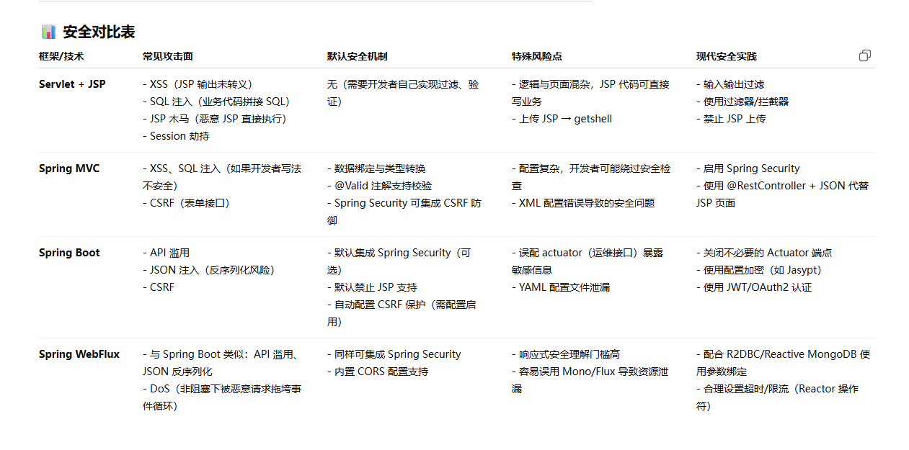

‍

在生产环境中，Spring Boot 一般不会直接对外暴露，而是通过 **Nginx 反向代理（这是一个现代渗透中至关重要的技术，直接关系到你的攻击面，不熟悉的的务必搜索补习）**

它可以设置只暴露需要暴露的路由，而像`/manager`这种页面会更加安全，缩窄了我们的攻击面，但nginx在大型项目中配置的复杂性也会导致开发运维人员有所遗漏，成为我们可利用的点，例如`/actuator`这种路径
